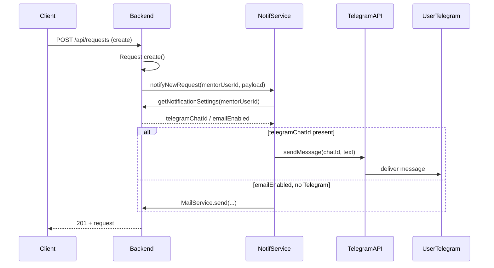

# Замена Email-уведомлений на Telegram: аналитический документ

## Введение

Цель: перевести отправку уведомлений с SMTP на Telegram Bot API, сохранив те же бизнес-сценарии (новая заявка, решение по заявке, отвязка). Документ даёт разработчику однозначную спецификацию «что» и «как» реализовать.

Официальная документация: [Telegram Bot API](https://core.telegram.org/bots/api), [Telegram API (обзор)](https://core.telegram.org/).

---

## 1. Взаимодействие с Telegram

### 1.1. Какие эндпоинты backend триггерят уведомления

Уведомления **не** имеют отдельного HTTP-эндпоинта типа `POST /api/notifications`. Они вызываются **внутри существующих сервисов** после успешного сохранения данных:

| Событие              | Где вызывается                                 | Файл/метод                            |
| -------------------- | ---------------------------------------------- | ------------------------------------- |
| Новая заявка создана | После `Request.create`                         | `requests.service.ts` → `create()`    |
| Заявка принята       | После обновления Request и создания Connection | `requests.service.ts` → `accept()`    |
| Заявка отклонена     | После обновления Request                       | `requests.service.ts` → `reject()`    |
| Связь откреплена     | После обновления Connection (status DETACHED)  | `connections.service.ts` → `detach()` |

То есть: те же точки, где сейчас вызывается `MailService.send*`, будут вызывать сервис Telegram (или единый NotificationService, который выбирает канал). Отдельный endpoint для «отправки уведомления» не нужен — только внутренние вызовы из бизнес-логики.

### 1.2. Схема данных: сопоставление пользователя с Telegram chat_id

- В Telegram доставка в личный чат выполняется по **chat_id** (уникальный идентификатор чата с пользователем). Получить chat_id можно только когда пользователь хотя бы раз взаимодействовал с ботом (например, нажал /start или отправил сообщение боту).
- **Рекомендуемая схема:** хранить в БД привязку «пользователь платформы → Telegram chat_id».

**Вариант A (рекомендуемый): расширить NotificationSettings**

- В модели `NotificationSettings` добавить поле `telegramChatId String?` (nullable).
- Если `telegramChatId != null` — отправлять уведомления в Telegram (и при необходимости не отправлять на email, если канал выбран «только Telegram»).
- Логика выбора канала (см. ниже): приоритет Telegram при наличии chat_id, иначе email (если включён).

**Вариант B: отдельная таблица UserTelegram**

- Таблица `UserTelegram` (userId, telegramChatId, createdAt). Один пользователь — один chat_id.
- NotificationSettings оставить для флага «включены ли уведомления»; канал доставки определять по наличию записи в UserTelegram.

В постановке зафиксировать **вариант A**: одна таблица настроек, поля `emailEnabled`, `telegramChatId`. При сохранении chat_id (после того как пользователь написал боту) обновлять `NotificationSettings.telegramChatId` для этого user.

**Как пользователь привязывает Telegram**

- В профиле/настройках: кнопка «Привязать Telegram». Показывается инструкция: «Напишите боту @YourBot в Telegram команду /start» (или ссылка t.me/YourBot?start=XXX с payload для идентификации пользователя).
- Бот при получении /start от пользователя получает `message.chat.id` — это и есть chat_id. По команде /start можно передать параметр (например start=USER_ID или токен), чтобы понять, какого пользователя платформы привязать. Альтернатива: пользователь вводит код с платформы в бота — бот отправляет код на backend, backend по коду находит userId и сохраняет chat_id. Рекомендация: **ссылка t.me/Bot?start=PAYLOAD**, где PAYLOAD — одноразовый токен или зашифрованный userId; при /start бот вызывает backend API «привязать chat_id к userId», backend сохраняет telegramChatId в NotificationSettings.

### 1.3. Формат сообщений в Telegram

- **Текст:** метод [sendMessage](https://core.telegram.org/bots/api#sendmessage). Параметр `text` — до 4096 символов (лимит API).
- **Разметка:** поддерживаются [Parse Mode](https://core.telegram.org/bots/api#formatting-options): `HTML` или `MarkdownV2`. Рекомендация: **HTML** (как в текущих письмах) с экранированием спецсимволов для тегов (`<`, `>`, `&`).
- **Кнопки:** [InlineKeyboardMarkup](https://core.telegram.org/bots/api#inlinekeyboardmarkup) — кнопки под сообщением. Например, «Перейти к заявкам» с URL на `https://your-app/requests/incoming`. Параметр `reply_markup` в sendMessage.
- **Ссылки:** в HTML: `<a href="https://...">текст</a>`. Или одна кнопка InlineKeyboard с url.

Итого: текст сообщения формировать так же по смыслу, как сейчас в MailService (темы писем → заголовок в начале текста или отдельным сообщением не обязательно); в теле — краткий текст + при необходимости кнопка «Открыть платформу» с ссылкой на соответствующий раздел (входящие заявки, мои заявки, связи).

### 1.4. Каналы доставки

- **Личный чат с пользователем:** основной канал. Каждое уведомление отправляется в `chat_id` получателя (ментор или менти), полученный при привязке Telegram.
- Группы и каналы в рамках данной задачи **не требуются**: уведомления персональные (новая заявка — конкретному ментору, решение — конкретному менти, отвязка — второй стороне). Если позже понадобится «уведомления для админов в общий чат» — можно добавить отдельную настройку (например, TELEGRAM_ADMIN_CHAT_ID для копий критичных событий).

### 1.5. Обработка ошибок доставки

- **Ответ API:** при отправке через Bot API возможны ошибки: 429 (rate limit), 400 (неверный chat_id, заблокировал бота и т.д.), 5xx (временная недоступность). Обрабатывать ответ каждого вызова sendMessage.
- **Рекомендации:**
  - **Логирование:** при любой ошибке отправки логировать (userId, тип события, код/текст ошибки). Не пробрасывать ошибку в ответ пользователю при создании заявки/accept/reject/detach — уведомление «best effort».
  - **Повторная отправка:** в MVP допустимо не делать очереди с повторами; при желании — простая повторная попытка 1–2 раза с задержкой (например 2–5 сек) при 5xx или 429.
  - **Fallback на Email:** если указано в требованиях — при неуспехе Telegram (или при отсутствии telegramChatId) вызывать существующий MailService при включённом emailEnabled. Ниже в п. 3 описан вариант «приоритет Telegram, иначе Email».

---

## 2. Архитектура и интеграция

### 2.1. Структура сервиса уведомлений

- **Вариант 1 (рекомендуемый):** ввести единый **NotificationService** (или переименовать/расширить текущий слой уведомлений), который инкапсулирует:
  - определение канала доставки для пользователя (есть ли telegramChatId, включён ли email);
  - формирование текста сообщения (общее для Telegram и Email);
  - вызов TelegramService (отправка в Bot API) и/или MailService (SMTP).
- **TelegramService:** один сервис в модуле `notifications`: метод `sendMessage(chatId: string, text: string, options?: { parse_mode?, reply_markup? })`, внутри — HTTP-запрос к `https://api.telegram.org/bot<token>/sendMessage`. Не знает о пользователях и событиях — только «отправить сообщение в чат».
- **NotificationService (или текущий MailService расширить):** методы `notifyNewRequest(mentorUserId, payload)`, `notifyRequestDecision(menteeUserId, payload)`, `notifyDetach(recipientUserId, payload)`. Внутри: для каждого userId загрузить NotificationSettings (emailEnabled, telegramChatId); если есть telegramChatId — сформировать текст и вызвать TelegramService.sendMessage; иначе если emailEnabled — вызвать MailService (как сейчас). Так сохраняются текущие сценарии и добавляется Telegram.

Альтернатива: оставить вызовы MailService в requests/connections и рядом добавить вызов TelegramService — тогда дублируется логика «кого уведомлять» и «что писать». Предпочтительно вынести в один слой (NotificationService).

### 2.2. Взаимодействие с существующей системой

- **События:** не вводить отдельную шину событий на этапе замены. Вызовы из `requests.service` и `connections.service` остаются синхронными по смыслу: после сохранения в БД вызывается сервис уведомлений. Отправка в Telegram (и при необходимости в Email) — **асинхронно** (не ждать ответа Bot API перед return из контроллера), как сейчас с письмами (then/catch, без await в ответ клиенту).
- **Очередь задач:** в MVP достаточно «fire-and-forget» (запуск отправки без ожидания). При необходимости позже — in-memory очередь (массив задач + обработка по таймеру) или внешняя очередь (Redis/Bull); не обязательно для первой версии.
- **Повторные попытки:** при 429 или 5xx можно повторить отправку 1–2 раза с задержкой; при 400 (например пользователь заблокировал бота) — не повторять, залогировать и при желании обнулить telegramChatId у этого пользователя, чтобы не слать в недействительный чат.

### 2.3. Telegram Bot API: методы и ссылки

- Документация: [Bot API](https://core.telegram.org/bots/api).
- **sendMessage:** [https://core.telegram.org/bots/api#sendmessage](https://core.telegram.org/bots/api#sendmessage). Параметры: `chat_id`, `text`, `parse_mode` (HTML или MarkdownV2), `reply_markup` (InlineKeyboardMarkup), `disable_web_page_preview`.
- **InlineKeyboardMarkup / InlineKeyboardButton:** [https://core.telegram.org/bots/api#inlinekeyboardmarkup](https://core.telegram.org/bots/api#inlinekeyboardmarkup). Для кнопки-ссылки: `{ text: "Открыть заявки", url: "https://..." }`.
- Лимиты: [частота](https://core.telegram.org/bots/faq#broadcasting-to-users) — не более ~30 сообщений в секунду в разные чаты; длина сообщения до 4096 символов.

### 2.4. Хранение токена бота

- Токен хранить только на бэкенде, в переменных окружения. Не попадать в клиентский код и в репозиторий.
- **.env:** добавить `TELEGRAM_BOT_TOKEN=<token>`. Получение токена: [@BotFather](https://t.me/BotFather) в Telegram, команда /newbot или /token.
- В коде: читать через ConfigService.get('TELEGRAM_BOT_TOKEN'). Если переменная не задана — TelegramService не инициализировать (или отправку считать отключённой), логировать предупреждение (аналогично текущему поведению при отсутствии SMTP).

---

## 3. Сценарии использования

Все три текущих сценария сохраняются; меняется только канал доставки (Telegram вместо или вместе с Email).

### 3.1. Новая заявка (получатель — ментор)

- **Триггер:** создание заявки, `requests.service.create()`.
- **Получатель:** ментор (userId берётся из профиля ментора).
- **Действие:** загрузить NotificationSettings ментора. Если есть telegramChatId — отправить в Telegram текст вида: «Новая заявка на менторство. От: [имя менти]. Сопроводительное письмо: [превью]. Войдите в платформу, чтобы принять или отклонить заявку.» + кнопка «Входящие заявки» (url на раздел входящих). Если telegramChatId нет и emailEnabled — отправить письмо (текущая логика).
- **Обязательность:** уведомление опционально в смысле «пользователь может отключить»; если уведомления включены и канал задан (Telegram или Email) — отправка обязательна с точки зрения бизнес-логики.

### 3.2. Решение по заявке (получатель — менти)

- **Триггер:** accept или reject в `requests.service`.
- **Получатель:** менти (userId из профиля менти).
- **Действие:** если есть telegramChatId — отправить в Telegram: «[Имя ментора] принял/отклонил вашу заявку. Результат: Заявка принята / Заявка отклонена.» + при принятии — «Откройте платформу, чтобы посмотреть контакты» и кнопка; при отклонении — «Откройте каталог менторов» и кнопка. Иначе при emailEnabled — письмо.
- **Обязательность:** аналогично п. 3.1.

### 3.3. Отвязка (получатель — вторая сторона связи)

- **Триггер:** `connections.service.detach()`.
- **Получатель:** пользователь, который не инициировал отвязку (ментор или менти).
- **Действие:** если у получателя есть telegramChatId — отправить: «Связь с [имя] прекращена. [Причина при наличии]. Войдите в платформу для просмотра связей.» + кнопка. Иначе при emailEnabled — письмо.
- **Обязательность:** аналогично.

### 3.4. Приоритет канала и fallback

- **Вариант A:** только один канал на пользователя. Если задан telegramChatId — отправлять только в Telegram; иначе — только на Email (если emailEnabled). Без дублирования.
- **Вариант B:** Telegram с fallback на Email. Сначала попытка в Telegram; при ошибке доставки (или при отсутствии chat_id) — отправить на Email при emailEnabled. В постановке зафиксировать **вариант A** для простоты; при необходимости fallback добавить позже.

---

## 4. Риски и ограничения

### 4.1. Лимиты Telegram API

- **Частота:** не более ~30 сообщений в секунду в разные чаты (на бота). Для платформы менторинга объём обычно укладывается в лимит.
- **Размер сообщения:** до 4096 символов. Превью текста заявки ограничивать (как сейчас 300 символов) — достаточно.
- **Медиа:** для текстовых уведомлений не требуются; при необходимости позже — лимиты на размер файла в [документации](https://core.telegram.org/bots/api).

### 4.2. Ошибки доставки и обработка

- **400 Bad Request:** неверный chat_id, пользователь заблокировал бота, чат удалён. Обработка: логировать; при повторяющихся ошибках для одного chat_id можно обнулить telegramChatId в БД, чтобы не слать повторно.
- **429 Too Many Requests:** лимит. Обработка: повтор через несколько секунд (1–2 попытки) или отложенная отправка; логировать.
- **5xx / сеть:** повтор 1–2 раза; при неудаче — только лог. Не блокировать ответ API пользователю.

### 4.3. Приватность и безопасность

- В сообщениях не передавать чувствительные данные (пароли, токены). Имена и превью текста заявки — допустимо (как в письмах).
- chat_id — конфиденциальный идентификатор; хранить в БД, не отдавать на фронт без необходимости. Токен бота — только на сервере, в .env.
- Пользователь должен явно привязать Telegram (написать боту /start или перейти по ссылке с привязкой). Не подставлять chat_id «из ниоткуда».

---

## 5. Результат аналитики

### 5.1. Схема взаимодействия

### 5.2. Таблица событий → сообщения → целевая аудитория

| Событие          | Получатель           | Текст (кратко)                                                          | Кнопка (пример)                        | Где триггер                  |
| ---------------- | -------------------- | ----------------------------------------------------------------------- | -------------------------------------- | ---------------------------- |
| Новая заявка     | Ментор               | Заявка от [имя менти]. Превью письма. Войдите, чтобы принять/отклонить. | «Входящие заявки» → /requests/incoming | requests.service create()    |
| Заявка принята   | Менти                | [Ментор] принял заявку. Откройте платформу для контактов.               | «Мои заявки» → /requests/outgoing      | requests.service accept()    |
| Заявка отклонена | Менти                | [Ментор] отклонил заявку. Откройте каталог менторов.                    | «Каталог» → /mentors                   | requests.service reject()    |
| Отвязка          | Вторая сторона связи | Связь с [имя] прекращена. [Причина]. Войдите в платформу.               | «Мои связи» → /connections             | connections.service detach() |

### 5.3. Предложения по реализации в коде

**Схема данных (Prisma)**  

- В `NotificationSettings` добавить `telegramChatId String?`. Миграция.

**Конфигурация (.env)**  

- `TELEGRAM_BOT_TOKEN` — токен бота от BotFather.  
- Опционально: `TELEGRAM_BOT_WEBHOOK_URL` — если позже будете использовать webhook вместо polling (для привязки по /start достаточно один раз получить updates или отдельный мини-endpoint для привязки).

**Сервисы**  

- `TelegramService`: метод `sendMessage(chatId: string, text: string, options?: { parse_mode?: 'HTML', reply_markup?: InlineKeyboardMarkup })`. Внутри: `axios.post(\`[https://api.telegram.org/bot${token}/sendMessage](https://api.telegram.org/bot${token}/sendMessage`), { chat_id, text, parse_mode, reply_markup })`. Обработка ответа: при 200 — ok; иначе логировать и при 400 можно вернуть признак «чат недоступен».  
- `NotificationService`: методы `notifyNewRequest(mentorUserId, payload)`, `notifyRequestDecision(menteeUserId, payload)`, `notifyDetach(recipientUserId, payload)`. В каждом: загрузка NotificationSettings; при наличии telegramChatId — формирование текста (HTML-экранирование для Telegram) и вызов TelegramService.sendMessage (асинхронно); иначе при emailEnabled — вызов MailService (как сейчас).  
- В `requests.service` и `connections.service` заменить прямые вызовы MailService и проверку getEmailEnabled на вызовы NotificationService (один вызов на событие).

**DTO / типы**  

- Полезно ввести типы событий: `NotificationEventType = 'NEW_REQUEST' | 'REQUEST_ACCEPTED' | 'REQUEST_REJECTED' | 'DETACH'`. Payload для каждого типа — те же поля, что сейчас передаются в MailService (имена, превью, причина и т.д.).

**Привязка Telegram пользователем**  

- Endpoint `POST /api/profile/me/telegram/link` с телом `{ telegramLinkToken: string }` или GET с query-параметром. Токен одноразовый, создаётся при нажатии «Привязать Telegram» на фронте (backend генерирует, сохраняет в кеш/таблицу с userId и TTL 10–15 мин). Бот при /start с start=TOKEN вызывает этот endpoint (или внутренний сервис), передаёт token и chat_id; backend по токену находит userId и записывает chat_id в NotificationSettings.  
- Альтернатива: бот не дергает backend напрямую; пользователь в боте вводит код с платформы; backend по коду ищет запись и chat_id приходит с фронта после того, как пользователь ввёл код в боте и бот отправил его на backend. Выбор — по предпочтениям команды; в документе достаточно описать один вариант (ссылка с start=token + endpoint для бота/внутренний вызов при получении updates).

**Очередь**  

- В MVP — без очереди: вызов NotificationService после сохранения в БД, внутри — асинхронная отправка (не await в цепочке ответа клиенту). При необходимости позже добавить in-memory или Redis-очередь.

Итог: разработчик может реализовать замену/дополнение уведомлений на Telegram по этому документу без дополнительных уточнений по объёму и правилам доставки.