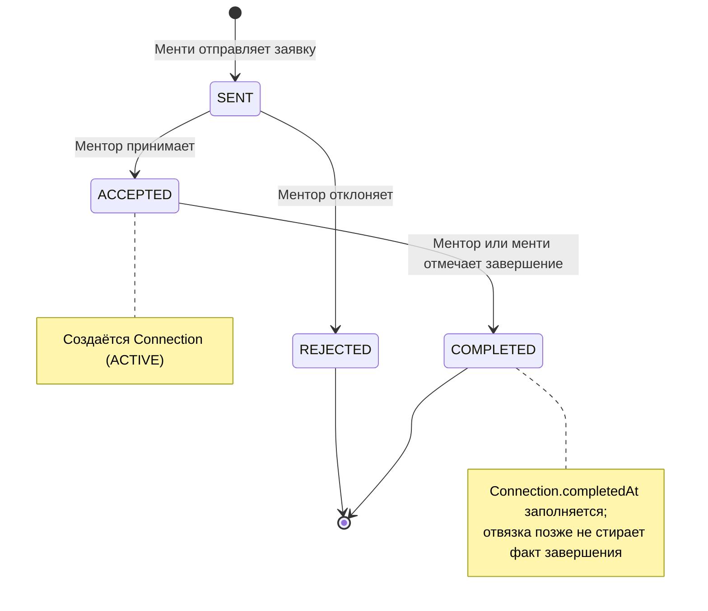
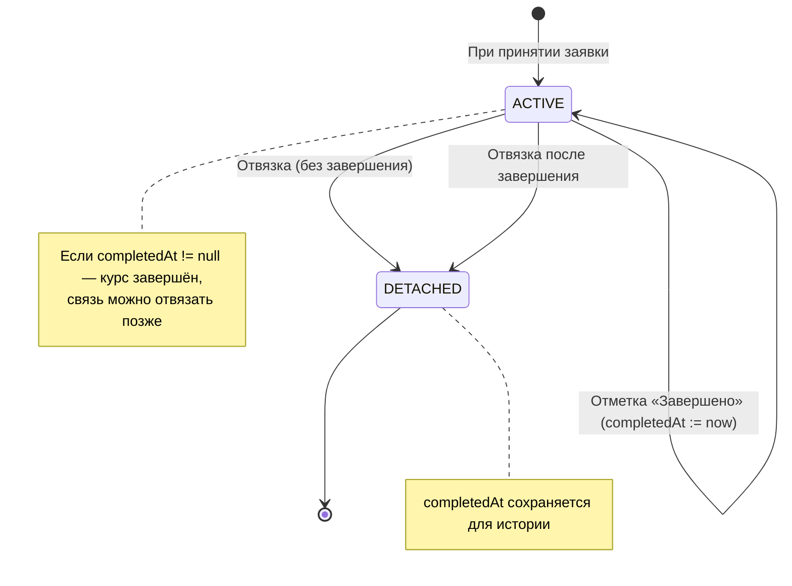

# Завершение менторства: статусы, данные и UI

## Цель документа

Спроектировать и описать процесс **успешного завершения менторства**: ввести статус «Завершено», определить роли и переходы, хранение данных, влияние на дашборды и историю. Сохранить отдельную отвязку без стирания факта завершения.

**Контекст:** заявка имеет статусы На рассмотрении (SENT), Подтверждена (ACCEPTED), Отклонена (REJECTED). После подтверждения создаётся связь ментор–менти (Connection со статусом ACTIVE). Есть отвязка (DETACHED), завершения курса пока нет.

---

## 1. Состояния заявки и переходы

### 1.1. Текущая схема (как есть)

- **Request (заявка):** `SENT` → ментор может перевести в `ACCEPTED` или `REJECTED`. Обратного перехода нет.
- **Connection (связь):** создаётся при `ACCEPTED` со статусом `ACTIVE`. Любая сторона может перевести в `DETACHED` (отвязка).

### 1.2. Новая схема с «Завершено»

Вводится понятие **успешного завершения курса**: заявка/связь помечаются как завершённые по инициативе ментора или менти (см. п. 1.3). После этого связь может по-прежнему быть откреплена; факт завершения при этом сохраняется.

**Статусы заявки (Request):**

| Код       | Отображение в UI   | Описание |
| --------- | ------------------ | -------- |
| SENT      | На рассмотрении    | Заявка отправлена, ждёт решения ментора. |
| ACCEPTED  | Подтверждена       | Ментор принял заявку, создана активная связь. |
| REJECTED  | Отклонена          | Ментор отклонил заявку. |
| COMPLETED | Завершено          | Менторство успешно завершено (отмечено одной из сторон). |

**Переходы и роли:**

| Переход       | Кто может выполнить | Условие |
| ------------- | -------------------- | -------- |
| SENT → ACCEPTED  | Ментор            | Заявка в статусе SENT, лимит активных менти не превышен. |
| SENT → REJECTED  | Ментор            | Заявка в статусе SENT. |
| ACCEPTED → COMPLETED | Ментор **или** менти | Заявка в статусе ACCEPTED, связь в статусе ACTIVE. |

Обратных переходов (COMPLETED → ACCEPTED, REJECTED → SENT и т.п.) не предусматривается.

**Связь (Connection):**

- Статусы связи остаются: `ACTIVE`, `DETACHED`.
- Добавляется **признак завершения**: момент времени `completedAt` (см. раздел 2).
- Переходы:
  - **ACTIVE → «завершён»:** при отметке «Курс завершён» выставляется `completedAt` и заявка переводится в COMPLETED. Статус связи при этом можно оставить ACTIVE (связь «активна, но курс завершён») или ввести отдельный статус COMPLETED для связи — см. рекомендацию ниже.
  - **ACTIVE → DETACHED:** отвязка без завершения (как сейчас).
  - **После завершения → DETACHED:** отвязка уже после того, как курс отмечен завершённым. Статус связи → DETACHED, поле `completedAt` **не очищается**, чтобы в истории оставалось «завершено, затем отвязка».

### 1.3. Кто отмечает завершение

**Варианты:**

1. **Только ментор** — просто, но менти не может зафиксировать завершение.
2. **Только менти** — симметрично не идеально.
3. **Любая сторона (ментор или менти)** — один нажал «Завершить» → статус COMPLETED и `completedAt`. Рекомендуется для MVP: минимум шагов, понятно обеим сторонам.
4. **Обе стороны должны подтвердить** — два шага (ментор нажал «Завершить», менти подтвердил, или наоборот). Точнее семантически, но сложнее в реализации и UX; можно заложить в модель данных позже (например, флаги `completedByMentor`, `completedByMentee` и считать завершённым при обоих true).

**Рекомендация:** для MVP — **вариант 3**: любую из сторон (ментор или менти) считаем имеющей право перевести заявку/связь в «Завершено». В интерфейсе: одна кнопка «Завершить менторство» / «Курс завершён» в карточке активной связи.

### 1.4. Диаграмма состояний заявки

Связь (Connection) в контексте завершения:

---

## 2. Данные и хранение

### 2.1. Изменения в моделях

**Request (заявка):**

- В enum `RequestStatus` добавить значение **COMPLETED**.
- Дополнительных полей не требуется: факт «когда завершено» храним на связи.

**Connection (связь ментор–менти):**

- Добавить поле **completedAt** (DateTime, nullable). Значение задаётся в момент отметки «Курс завершён» и **не обнуляется** при отвязке.
- Опционально: поле **completedByUserId** (String, nullable) — кто нажал «Завершить» (для аудита и возможного сценария «оба подтверждают» в будущем).

Итого минимально:

- `Request.status`: добавить `COMPLETED`.
- `Connection.completedAt`: добавить `DateTime?`.

### 2.2. Логирование и отчёты

- **История менторства:** список заявок/связей с фильтром по статусу. Завершённые — `Request.status = COMPLETED` и/или `Connection.completedAt IS NOT NULL`. Для отображения «завершённые курсы» достаточно этих полей.
- **Дашборд / статистика:**
  - Ментор: количество активных менти (Connection ACTIVE и без completedAt или с completedAt — в зависимости от того, считаем ли «завершённые, но ещё не отвязанные» активными; рекомендуется считать активными только без completedAt), количество завершённых менторств (Connection с completedAt не null, по связи можно вывести дату и пару ментор–менти).
  - Менти: количество активных связей, количество завершённых курсов.
- Отдельную таблицу «событий» для MVP можно не вводить: хватает полей заявки и связи плюс при необходимости `completedByUserId`.

### 2.3. Целостность и ограничения

- Отметка «Завершено» допустима только если заявка в статусе ACCEPTED и связь существует и в статусе ACTIVE (и при этом ещё не завершена, т.е. completedAt пусто).
- При отвязке: обновлять только `status`, `detachedAt`, `reason`; `completedAt` не трогать.

---

## 3. Влияние на UI

### 3.1. Где отображать статус «Завершено»

- **Список заявок (ментор / менти):** для заявки в статусе COMPLETED — подпись/бейдж «Завершено», при необходимости дата завершения (из Connection.completedAt).
- **Карточка заявки:** при COMPLETED показывать текст вроде «Менторство завершено» и дату.
- **Раздел «Мои связи» (connections):**
  - Активные: связь ACTIVE и completedAt = null. Кнопка «Завершить менторство» + кнопка «Отвязаться».
  - Завершённые, но ещё не отвязанные: ACTIVE и completedAt != null. Показать «Курс завершён», дату, кнопку «Отвязаться» (отвязка не убирает факт завершения).
  - Отвязанные: DETACHED. Если completedAt != null — показывать «Завершено ранее» / «Курс был завершён», дату завершения и дату отвязки.

### 3.2. Дашборд ментора

- Блок «Активные менти»: число связей со статусом ACTIVE и без completedAt (или с учётом политики «завершённые тоже активные до отвязки» — тогда просто ACTIVE).
- Блок «Завершённые менторства»: число связей с заполненным completedAt (независимо от ACTIVE/DETACHED). Краткий список последних с датой и именем менти.
- Входящие заявки — без изменений (SENT/ACCEPTED/REJECTED/COMPLETED в списке с понятными подписями).

### 3.3. Дашборд менти

- «Активные связи»: связи ACTIVE без completedAt (или все ACTIVE — по той же политике).
- «Завершённые курсы»: связи с completedAt != null; при отвязке — помечать «Завершён, связь прекращена» с датами.
- Исходящие заявки — показывать статус, включая «Завершено».

### 3.4. Элементы управления

- В карточке **активной** связи (ACTIVE, completedAt пусто): кнопка **«Завершить менторство»** (или «Курс завершён»). По нажатию — вызов API завершения (см. раздел 4); после успеха — обновить статус в UI, убрать кнопку завершения, при необходимости показать кнопку «Отвязаться».
- Подтверждение: диалог «Вы уверены, что хотите отметить менторство как завершённое?» — по желанию продукта.

---

## 4. API и интеграции

### 4.1. Новый эндпоинт для отметки завершения

**Вариант A (рекомендуемый): действие над связью**

- **PATCH** ` /api/connections/:id/complete`  
  или **POST** ` /api/connections/:id/complete`  
  (без тела или с телом `{}` для расширяемости).

- **Права:** только участник связи (ментор или менти).
- **Условия:** связь существует, статус ACTIVE, completedAt пусто.
- **Действие:** установить Connection.completedAt = now(), при необходимости completedByUserId = текущий user.id; обновить Request.status = COMPLETED.
- **Ответ:** обновлённый объект связи (включая completedAt) и при необходимости заявки.

**Вариант B: действие над заявкой**

- **PATCH** ` /api/requests/:id/complete` — по смыслу то же (проверка, что заявка ACCEPTED и связь ACTIVE; обновление связи и заявки). Менее естественно, т.к. завершение — это про связь; рекомендуется вариант A.

### 4.2. Изменения существующих эндпоинтов

- **GET** списков заявок (входящие/исходящие): в ответ включать статус COMPLETED и при наличии — дату завершения из связанной Connection (completedAt). Фильтры: при необходимости «только завершённые», «активные и завершённые» и т.д.
- **GET** списка связей: возвращать поле **completedAt** (и при необходимости флаг «isCompleted»). Сортировка/фильтр: активные без завершения, завершённые, отвязанные с завершением.
- **POST** `.../connections/:id/detach`: без изменений логики; при обновлении связи в DETACHED не трогать completedAt.

### 4.3. Уведомления (будущие интеграции)

- При переводе в «Завершено» можно в дальнейшем добавить уведомление второй стороне (email/Telegram): «[Имя] отметил(а) менторство как завершённое». В текущем документе — только задел; реализация по плану уведомлений (например, plans/9, 10).

---

## 5. Критерии приёмки

- Отметить курс завершённым можно **только** после подтверждения заявки (заявка ACCEPTED, связь ACTIVE).
- Завершённые менторства отображаются в истории (списки заявок и связей с статусом/датой завершения и в блоках «Завершённые» на дашбордах).
- Отвязка после завершения **не** стирает факт завершения: completedAt сохраняется, в UI отображается и «Завершено», и «Связь прекращена».

---

## 6. Краткие технические рекомендации

- **Prisma:** добавить в enum `RequestStatus` значение `COMPLETED`; в модель `Connection` — поле `completedAt DateTime?`. Миграция.
- **Сервис связей:** метод `complete(userId, connectionId)`: проверка участника, статус ACTIVE, отсутствие completedAt; транзакция: обновить Connection.completedAt (и при необходимости completedByUserId), Request.status = COMPLETED.
- **Контроллер:** `PATCH` или `POST` `connections/:id/complete`, guard по JWT, вызов `connectionsService.complete(req.user.id, id)`.
- **Списки:** при отдаче заявок и связей включать в ответ поле завершения (completedAt, статус COMPLETED), чтобы фронт мог строить фильтры и блоки статистики.

---

## 7. Итоговая сводка

| Аспект | Решение |
|--------|--------|
| Новый статус заявки | COMPLETED; переход только из ACCEPTED. |
| Кто отмечает завершение | Ментор или менти (один клик), MVP. |
| Хранение факта завершения | Connection.completedAt (и опционально completedByUserId); при отвязке не обнулять. |
| Отвязка после завершения | Допускается; статус связи DETACHED, completedAt остаётся для истории. |
| API | PATCH/POST `/api/connections/:id/complete`; GET-списки возвращают completedAt и COMPLETED. |
| UI | Бейдж «Завершено», кнопка «Завершить менторство» у активной связи, блоки «Завершённые» на дашбордах ментора и менти. |

Документ готов к использованию разработкой и дизайном для реализации сценария успешного завершения менторства.
