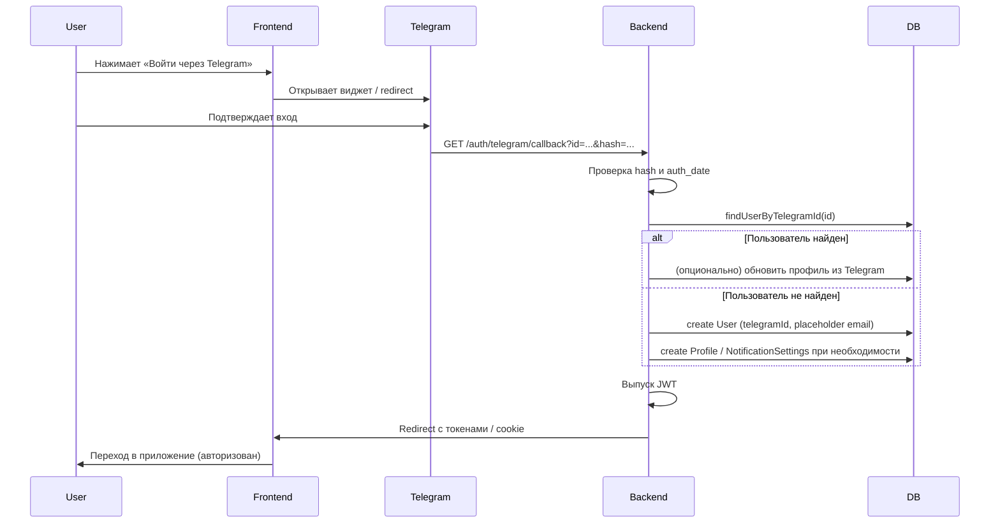

# Telegram: авторизация и уведомления — аналитический документ

## Цель документа

Дать разработчикам полное понимание:
1. Как подключить **авторизацию через Telegram** (Telegram Login) и хранить данные для уведомлений.
2. Как хранить привязку пользователя к Telegram (**chat_id**) для отправки сообщений.
3. Как строить **отправку уведомлений в Telegram** вместо (или вместе с) email.

**Важно:** Документация [Telegram API — User Authorization](https://core.telegram.org/api/auth) описывает **MTProto-авторизацию** (вход по номеру телефона, коды, 2FA) для полноценных клиентов. Для **входа на сайт** используется **Telegram Login Widget** ([документация](https://core.telegram.org/widgets/login)). Для **отправки сообщений** — **Telegram Bot API** ([документация](https://core.telegram.org/bots/api)).

---

## Часть 1. Авторизация через Telegram

### 1.1. Что такое Telegram Login (для веб-сайта)

- **Telegram Login Widget** — виджет на сайте «Войти через Telegram». Пользователь нажимает кнопку, открывается окно Telegram (или редирект), подтверждает вход, и на сайт возвращаются данные пользователя.
- Данные приходят в виде параметров (redirect) или колбэка (JavaScript). **chat_id при этом не передаётся** — только идентификатор пользователя Telegram и профильные поля.
- Для отправки сообщений от бота нужен **chat_id**. В личном чате с пользователем в Bot API выполняется равенство: **chat_id = telegram user id**. То есть идентификатор из виджета можно использовать как chat_id, **но** бот не может первым написать пользователю — пользователь должен хотя бы раз написать боту (например, нажать Start). Это ограничение Bot API.

Итого:
- **Вход на сайт** — Telegram Login Widget → получаем `id`, `first_name`, `last_name`, `username`, `photo_url`, `auth_date`, `hash`.
- **Доставка уведомлений** — Bot API по `chat_id`; для пользователя, вошедшего через виджет, `chat_id = id`, но отправка возможна только после того, как пользователь **начал диалог с ботом** (например, перешёл по ссылке вида `t.me/YourBot` и нажал Start).

### 1.2. Данные, получаемые от Telegram (Login Widget)

После успешного входа через виджет Telegram передаёт (все поля опциональны, кроме `id` и `auth_date`):

| Поле         | Тип    | Описание                          |
| ------------ | ------ | --------------------------------- |
| `id`         | number | Уникальный идентификатор пользователя Telegram. Используется для привязки к нашему User и как chat_id в личном чате. |
| `first_name` | string | Имя.                               |
| `last_name`  | string | Фамилия (может отсутствовать).     |
| `username`   | string | @username (может отсутствовать).   |
| `photo_url`  | string | URL аватара (может отсутствовать). |
| `auth_date`  | number | Unix-время авторизации.           |
| `hash`       | string | Подпись для проверки подлинности. |

**Проверка подлинности (обязательна на backend):**

1. Собрать строку для проверки: все поля **кроме hash** в алфавитном порядке в формате `key=<value>`, через перевод строки.
2. Секретный ключ: `SHA256(bot_token)`.
3. Вычислить `HMAC-SHA256(data_check_string, secret_key)` и сравнить с `hash` (в hex).
4. Проверить `auth_date`: не старше разумного порога (например, 24 часа), чтобы исключить повторное использование старых данных.

Официальное описание: [Telegram Login Widget](https://core.telegram.org/widgets/login).

### 1.3. Поток авторизации через Telegram

**Шаг 1. Настройка бота и домена**

- Создать бота через [@BotFather](https://t.me/BotFather), получить токен.
- В BotFather для бота выполнить `/setdomain` и указать домен сайта (например, `app.mentoring.company`). Без этого виджет не будет работать.

**Шаг 2. Фронтенд**

- На странице входа (и при необходимости на странице регистрации) отобразить кнопку «Войти через Telegram».
- Подключить скрипт виджета: `https://telegram.org/js/telegram-widget.js?22`.
- Виджет настраивается с `data-telegram-login="<bot_username>"`, `data-auth-url` (куда Telegram сделает redirect с параметрами) или callback.
- Рекомендуется **redirect**: после нажатия пользователем «Allow» Telegram перенаправляет на URL вида  
  `https://your-app/auth/telegram/callback?id=...&first_name=...&hash=...` и т.д.

**Шаг 3. Backend: endpoint приёма callback**

- Маршрут, например: `GET /api/auth/telegram/callback` с query-параметрами: `id`, `first_name`, `last_name`, `username`, `photo_url`, `auth_date`, `hash`.
- Логика:
  1. Проверить наличие всех нужных полей и `hash`.
  2. Проверить подпись (HMAC, как в п. 1.2) и `auth_date`.
  3. Если проверка не прошла — редирект на страницу входа с ошибкой («Недействительная авторизация Telegram»).
  4. Найти пользователя по `telegram_id` (поле в БД, см. ниже). Если найден — войти (выдать JWT, создать/обновить сессию).
  5. Если не найден — **создать нового пользователя**: привязать `telegram_id`, сохранить имя/фамилию/username/photo по необходимости; для поля `email` в текущей схеме (обязательное, уникальное) использовать placeholder, например `telegram_<id>@telegram.placeholder`, чтобы не ломать уникальность и не делать email nullable. Пароль для такого пользователя не задаётся (вход только через Telegram) или хранится пустой/случайный.
  6. Редирект на главную страницу приложения с выданными токенами (например, токены в query/fragment или сохранение в httpOnly cookie — по текущей реализации фронта).

**Шаг 4. Получение и сохранение chat_id**

- **Вариант A (минимальный):** храним только `telegram_id` из виджета. В Bot API для личного чата `chat_id === telegram user id`. При отправке уведомления вызываем `sendMessage(chat_id: telegram_id)`. Если пользователь ещё не начинал диалог с ботом, Telegram вернёт ошибку (бот не может первым написать). Обработка: логируем, при желании fallback на email; в профиле можно показывать подсказку «Чтобы получать уведомления в Telegram, откройте @YourBot и нажмите Start».
- **Вариант B (явная привязка):** отдельный шаг «Привязать Telegram для уведомлений». Пользователь (уже авторизованный по email или по Telegram) переходит по ссылке вида `t.me/YourBot?start=link_<one_time_token>`. Бот при получении команды `/start link_<token>` получает `message.chat.id` и вызывает backend (webhook или внутренний сервис), передавая токен и chat_id; backend по токену находит userId и сохраняет `telegramChatId` в настройках уведомлений. Так мы явно знаем, что пользователь начал диалог с ботом.

Рекомендация: поддерживать оба подхода — при входе через Telegram сохраняем `telegram_id` и используем его как chat_id; при этом в настройках уведомлений показывать «Откройте @Bot и нажмите Start, чтобы получать уведомления». Дополнительно можно реализовать привязку по ссылке с токеном для пользователей, входящих только по email (тогда chat_id у них появится только после перехода по ссылке и /start).

### 1.4. Ошибки и отмена авторизации

- **Пользователь закрыл окно / нажал «Cancel» в Telegram:** на наш callback не приходит редирект; пользователь остаётся на странице входа. Дополнительная обработка не требуется.
- **Неверный или устаревший hash:** не проходить проверку подписи или `auth_date` → редирект на логин с сообщением об ошибке, не создавать сессию.
- **Ошибка при создании/поиске пользователя (БД):** обработать как обычную ошибку входа (логирование, ответ 500 или редирект с сообщением «Попробуйте позже»).
- **Пользователь уже зарегистрирован по email:** если решено не связывать автоматически аккаунт по email с Telegram по id (например, без ввода email при первом входе через Telegram), то при первом входе через Telegram создаётся новый пользователь с placeholder email. Если нужна связка «один человек — один аккаунт», можно на callback проверять: есть ли уже пользователь с таким `telegram_id`; если да — входить в него; если нет — создавать нового. Слияние аккаунтов (email + Telegram) можно вынести в отдельный сценарий (например, «Привязать Telegram» в настройках профиля с проверкой текущего пользователя).

### 1.5. Связь с существующей системой пользователей

**Рекомендуемая схема БД:**

- **Не создавать отдельную таблицу только для Telegram Login.** Расширить существующие модели.
- **User:** добавить поля (все опциональны для обратной совместимости):
  - `telegramId BigInt? @unique` — идентификатор пользователя Telegram из виджета.
  - При необходимости: `telegramUsername String?`, `telegramFirstName String?`, `telegramLastName String?` (или заполнять Profile при первом входе из Telegram).
- **Profile:** при входе через Telegram можно подставлять `firstName`, `lastName` из виджета, если у пользователя профиль ещё не заполнен; при наличии — не перезаписывать.
- **NotificationSettings:** добавить поле `telegramChatId String?` (или `BigInt?`). Если используем только `telegram_id` из User как chat_id, то отдельное поле `telegramChatId` можно не вводить и брать chat_id из `User.telegramId`; если реализуем привязку по ссылке для пользователей без Telegram Login — тогда `telegramChatId` нужно (и оно может отличаться от `User.telegramId` только в edge-cases, но логически «источник правды» для доставки — именно настройки уведомлений).

Итого:
- **Вариант 1:** в `User` храним `telegramId`; в `NotificationSettings` храним `telegramChatId` (для единообразия и сценария «привязка по ссылке»). При входе через Telegram заполняем `User.telegramId` и при создании/обновлении NotificationSettings копируем туда тот же id как `telegramChatId` (или оставляем заполнение только через привязку по ссылке).
- **Вариант 2:** только `User.telegramId`; при отправке уведомлений берём chat_id из `User.telegramId` для пользователей, вошедших через Telegram; для «только email» пользователей с привязкой по ссылке храним `telegramChatId` в NotificationSettings.

В документе зафиксируем: в **User** добавляем `telegramId` (для входа и идентификации); в **NotificationSettings** добавляем **telegramChatId** — сюда записываем chat_id при входе через Telegram (равен telegramId) или при привязке по ссылке. Так один источник правды для «куда слать уведомления».

---

## Часть 2. Уведомления через Telegram

### 2.1. Типы уведомлений (сейчас уходят на email)

Все три сценария остаются; меняется канал доставки (Telegram вместо или вместе с email).

| Событие              | Кто получает | Когда                         | Содержание (смысл) |
| -------------------- | ------------ | ----------------------------- | -------------------- |
| Новая заявка         | Ментор       | После создания заявки         | От кого заявка, превью письма, призыв зайти и принять/отклонить. |
| Решение по заявке    | Менти        | После принятия или отклонения | Ментор принял/отклонил заявку; при принятии — зайти за контактами; при отклонении — зайти в каталог. |
| Отвязка              | Вторая сторона связи | После открепления связи | С кем связь прекращена, причина (если есть), зайти в раздел связей. |

Текущая реализация: `MailService.sendNewRequestNotification`, `sendRequestDecisionNotification`, `sendDetachNotification`; вызовы из `requests.service` (create, accept, reject) и `connections.service` (detach). Перед отправкой проверяется `getEmailEnabledForUserId(userId)`.

### 2.2. Содержание и формат сообщений в Telegram

- **Текст:** метод [sendMessage](https://core.telegram.org/bots/api#sendmessage), параметр `text` до 4096 символов. Рекомендуется **parse_mode: HTML** (как в письмах), с экранированием `<`, `>`, `&` в пользовательском контенте.
- **Кнопки:** [InlineKeyboardMarkup](https://core.telegram.org/bots/api#inlinekeyboardmarkup) — одна кнопка под сообщением, например «Входящие заявки» с `url` на `https://your-app/requests/incoming` (или аналогичный путь).

Конкретика по событиям:

1. **Новая заявка (ментор):**  
   Текст: «Новая заявка на менторство. От: [имя менти]. Сопроводительное письмо: [превью]. Войдите в платформу, чтобы принять или отклонить заявку.»  
   Кнопка: «Входящие заявки» → ссылка на раздел входящих заявок.

2. **Заявка принята (менти):**  
   Текст: «[Имя ментора] принял вашу заявку. Откройте платформу, чтобы посмотреть контактные данные ментора.»  
   Кнопка: «Мои заявки» или «Открыть платформу» → ссылка на исходящие заявки / связи.

3. **Заявка отклонена (менти):**  
   Текст: «[Имя ментора] отклонил вашу заявку. Откройте каталог менторов, чтобы выбрать другого.»  
   Кнопка: «Каталог менторов» → ссылка на каталог.

4. **Отвязка:**  
   Текст: «Связь с [имя] прекращена. [Причина при наличии.] Войдите в платформу для просмотра своих связей.»  
   Кнопка: «Мои связи» → ссылка на раздел связей.

Превью текста заявки ограничивать (как сейчас, например 300 символов) во избежание длинных сообщений.

### 2.3. Способ отправки: Telegram Bot API

- Один и тот же бот, что используется для Login Widget: отправка через `https://api.telegram.org/bot<token>/sendMessage`.
- Параметры: `chat_id`, `text`, `parse_mode` (HTML), `reply_markup` (JSON для InlineKeyboard при необходимости).
- **Ограничения:** не более ~30 сообщений в секунду в разные чаты; длина сообщения до 4096 символов. Для платформы менторинга объём обычно в пределах нормы.
- Токен бота хранить только на backend (например, `TELEGRAM_BOT_TOKEN` в .env).

### 2.4. Когда не отправлять / fallback

- Если у пользователя **нет telegramChatId** (и не используем User.telegramId как chat_id) — в Telegram не отправляем; при включённом email отправляем письмо (текущая логика).
- Если **есть telegramChatId** (или telegramId в User) — пробуем отправить в Telegram. При ошибке (например, 400 — пользователь заблокировал бота):
  - логируем;
  - опционально: один канал на пользователя — только Telegram **или** только Email; либо fallback: при неуспехе Telegram отправить на email, если emailEnabled.
- Пользователь «не авторизован в Telegram» в смысле «никогда не начинал диалог с ботом»: при отправке получим ошибку от API — обрабатываем как выше (лог, при необходимости fallback на email).

---

## Часть 3. Взаимодействие с системой

### 3.1. Изменения в базе данных

- **User:** добавить `telegramId BigInt? @unique` (и при необходимости профильные поля из Telegram).
- **NotificationSettings:** добавить `telegramChatId String?` (или `BigInt?`). Использовать для хранения chat_id, куда слать уведомления (при входе через Telegram записывать туда тот же id; при привязке по ссылке — chat_id из бота).
- Флаги подписки: существующий `emailEnabled` оставить; при наличии `telegramChatId` считать, что пользователь разрешил уведомления в Telegram (при желании можно ввести отдельный флаг `telegramEnabled` позже).

### 3.2. Как генерируются уведомления (триггеры)

- Без введения отдельной шины событий: те же точки, что и сейчас.
  - **Новая заявка:** после успешного `Request.create` в `requests.service.create()`.
  - **Решение по заявке:** после обновления заявки и при необходимости создания связи в `requests.service.accept()` и `requests.service.reject()`.
  - **Отвязка:** после обновления связи в `connections.service.detach()`.
- В этих точках вызывать **единый сервис уведомлений** (например, `NotificationService`): методы `notifyNewRequest(mentorUserId, payload)`, `notifyRequestDecision(menteeUserId, payload)`, `notifyDetach(recipientUserId, payload)`. Внутри сервис:
  - загружает настройки получателя (emailEnabled, telegramChatId);
  - формирует текст (и кнопку) для Telegram;
  - при наличии telegramChatId вызывает TelegramService.sendMessage (асинхронно);
  - при отсутствии Telegram или по политике fallback при ошибке — при emailEnabled вызывает MailService (как сейчас).
- Отправку в Telegram и почту не блокировать ответ API (fire-and-forget или then/catch), как сейчас с письмами.

### 3.3. Поведение при отсутствии привязки Telegram

- **Вариант A (рекомендуемый для MVP):** один канал на пользователя. Если задан telegramChatId — отправлять только в Telegram; иначе — только на email при emailEnabled. Без дублирования.
- **Вариант B:** приоритет Telegram, при ошибке или отсутствии chat_id — fallback на email при emailEnabled.
- Если ни Telegram, ни email недоступны — только логирование, ответ пользователю по основному действию (создание заявки, accept/reject, detach) не блокируется.

---

## Часть 4. Документация и рекомендации

### 4.1. Ссылки

- [Telegram Login Widget](https://core.telegram.org/widgets/login) — вход на сайт.
- [Telegram Bot API](https://core.telegram.org/bots/api) — отправка сообщений, sendMessage, InlineKeyboard.
- [Telegram API (обзор)](https://core.telegram.org/) — общий контекст.
- [User Authorization (MTProto)](https://core.telegram.org/api/auth) — для справки (клиентская авторизация по телефону, не для веб-логина).

### 4.2. Поток данных: авторизация через Telegram



### 4.3. Поток данных: отправка уведомления (новая заявка)

```mermaid
sequenceDiagram
  participant Client
  participant Backend
  participant NotifService
  participant TelegramAPI
  participant MailService

  Client->>Backend: POST /api/requests (create)
  Backend->>Backend: Request.create()
  Backend->>NotifService: notifyNewRequest(mentorUserId, payload)
  NotifService->>Backend: getNotificationSettings(mentorUserId)
  Backend-->>NotifService: telegramChatId, emailEnabled
  alt telegramChatId present
    NotifService->>TelegramAPI: sendMessage(chatId, text, reply_markup)
    TelegramAPI-->>NotifService: 200 or error
    Note over NotifService: При ошибке: лог; опционально fallback на email
  else no Telegram, emailEnabled
    NotifService->>MailService: sendNewRequestNotification(...)
  end
  Backend-->>Client: 201 + request
```

### 4.4. Риски и ограничения

- **Rate limits:** до ~30 сообщений/сек в разные чаты. Для менторинга достаточно; при росте нагрузки — очередь или батчинг.
- **Бот не может первым написать:** пользователь должен хотя бы раз начать диалог с ботом (Start). Иначе отправка по его telegram id вернёт ошибку — обрабатывать логом и при необходимости fallback на email или подсказкой в профиле.
- **Безопасность:** токен бота только на backend; проверка hash при Telegram Login обязательна; в сообщениях не передавать пароли и чувствительные токены.
- **Приватность:** chat_id и telegram_id хранить в БД, не отдавать на фронт без необходимости.

### 4.5. Оценка трудозатрат (ориентировочно)

| Блок | Оценка | Комментарий |
|------|--------|-------------|
| Backend: проверка hash Telegram Login, endpoint callback, поиск/создание User по telegramId, выдача JWT | 1–2 дня | Зависит от текущей структуры auth. |
| Схема БД: telegramId в User, telegramChatId в NotificationSettings, миграции | 0.5 дня | |
| Frontend: кнопка «Войти через Telegram», redirect/callback, сохранение токенов | 1 день | |
| TelegramService (sendMessage), формирование текста и InlineKeyboard для 3 типов событий | 1 день | |
| NotificationService: выбор канала, вызов Telegram/Mail, интеграция в requests.service и connections.service | 1–2 дня | |
| Привязка по ссылке t.me/Bot?start=token (опционально): генерация токена, endpoint для бота, webhook или polling | 0.5–1 день | |
| Тесты, обработка ошибок, документация в коде | 1 день | |

**Итого (оценка):** порядка **6–9 человеко-дней** для полного цикла: вход через Telegram + уведомления в Telegram с fallback на email по выбранной политике.

---

## Итоговая сводка для разработчика

1. **Telegram Login:** виджет на сайте → callback на backend → проверка hash → find/create User по telegramId → JWT. В User храним telegramId; при создании/обновлении NotificationSettings можно записать тот же id в telegramChatId.
2. **chat_id:** для личного чата chat_id = telegram user id; отправка возможна только после того, как пользователь начал диалог с ботом (например, нажал Start). Либо реализовать привязку по ссылке с одноразовым токеном и сохранением chat_id из бота.
3. **Уведомления:** те же три события (новая заявка, решение по заявке, отвязка); единый NotificationService; при наличии telegramChatId — отправка в Telegram (sendMessage + при необходимости InlineKeyboard); иначе при emailEnabled — MailService. Ошибки не блокируют ответ API, только логирование и при необходимости fallback на email.
4. **Документация и лимиты:** использовать только официальные Telegram Login Widget и Bot API; учитывать лимиты по частоте и размеру сообщения; токен и идентификаторы хранить на backend.

Этот документ покрывает требования и потоки для замены текущей email-отправки уведомлений на Telegram с реализацией авторизации через Telegram.
